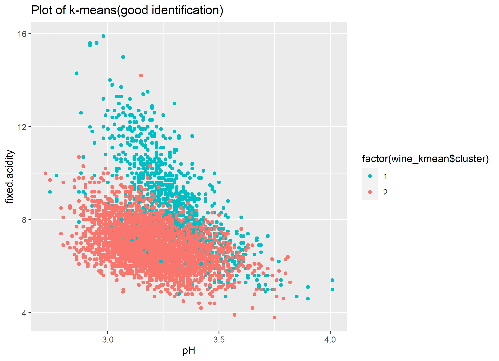
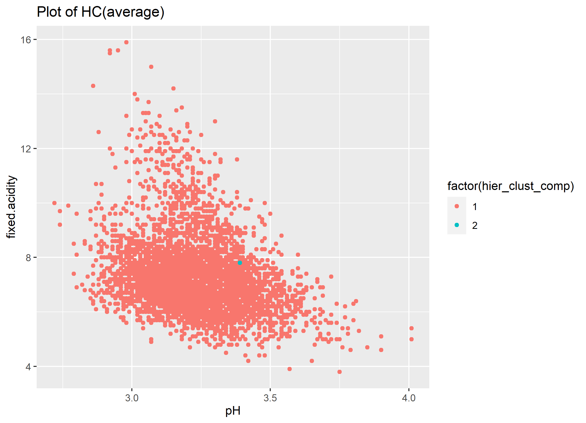

```{r, include=FALSE,eval=FALSE}
options(tinytex.verbose = TRUE)
options(dplyr.summarise.inform = FALSE)
```

```{r setup, include=FALSE,eval=FALSE}
library(magrittr)
library(dplyr)
library(tidyverse) 
library(sjmisc)
library(ggplot2)
library(reshape2)
library(gapminder)
library(mosaic)
library(extraDistr)
library(caret)
library(modelr)
library(parallel)
library(foreach)
library(rsample)
library(lubridate)
library(olsrr)
library(rpart)
library(rpart.plot)
library(randomForest)
library(gbm)
library(gamlr)
```

# 1) Clustering and PCA

## 1-1 Procedures

1. Distinguishing White and Red

we used the method of PCA(rank=2) and the Clustering(K-means(K=2), Hierarchical clustering with "single", "complete" and "average")


2. Distinguishing Quality

we used the method of PCA(rank=2) and the Clustering(K-means(K=7)). Note that the reason of not using hierarchical clustering is that this way does not show

## 1-2 Result (White and Red)

```{r, echo=FALSE, message=FALSE, warning=FALSE, results='hide',eval=FALSE}
wine <- read.csv("wine.csv")

## PCA
pca_result <- prcomp(wine[-13], scale. = TRUE)
wine_types <- as.factor(wine$color)
levels(wine_types) <- c("Red", "White")

# Prepare the PCA data for ggplot2
pca_data <- as.data.frame(pca_result$x[, 1:2])
colnames(pca_data) <- c("PC1", "PC2")
pca_data$wine_type <- wine_types

# Visualize PCA results
ggplot(pca_data, aes(x = PC1, y = PC2, color = wine_type)) +
  geom_point(alpha = 0.7) +
  theme_bw() +
  labs(title = "PCA Plot of Wine Data", x = "PC1", y = "PC2") +
  theme(legend.title = element_text(size = 12), legend.text = element_text(size = 10))
ggsave("./fig/1pca.png")

## Clustering
# K-means
# we wanna to identify them into two clusters and so use K-means at 2.
X = wine[-13]
X = scale(X, center=TRUE, scale=TRUE)

wine_kmean = kmeans(X, 2, nstart=25)

# Red and White (Actual data)
ggplot(wine) + 
  geom_point(aes(pH,fixed.acidity, color=factor(color)))
ggsave("./fig/1act1.png")

# Good identification
ggplot(wine) + 
  geom_point(aes(pH,fixed.acidity, color=factor(wine_kmean$cluster)))+
    labs(title="Plot of k-means(good identification)") +
   scale_color_manual(values=c("#00BFC4","#F8766D"))
ggsave("./fig/1km1.png")


## Hierarchical clustering
wine_distance_matrix = dist(X, method='euclidean')

hier_wine = hclust(wine_distance_matrix, method='single')
hier_clust_sing = cutree(hier_wine, k=2)
hier_wine = hclust(wine_distance_matrix, method='complete')
hier_clust_comp = cutree(hier_wine, k=2)
hier_wine = hclust(wine_distance_matrix, method='average')
hier_clust_avg = cutree(hier_wine, k=2)

# H-clustering -> bad
ggplot(wine) + 
  geom_point(aes(pH,fixed.acidity, color=factor(hier_clust_sing)))+
    labs(title="Plot of HC(single)",
        x ="pH", y = "fixed.acidity")
ggsave("./fig/1sing.png")
ggplot(wine) + 
  geom_point(aes(pH,fixed.acidity, color=factor(hier_clust_comp)))+
    labs(title="Plot of HC(average)",
        x ="pH", y = "fixed.acidity")
ggsave("./fig/1comp.png")
ggplot(wine) + 
  geom_point(aes(pH,fixed.acidity, color=factor(hier_clust_avg)))+
    labs(title="Plot of HC(complete)",
        x ="pH", y = "fixed.acidity")
ggsave("./fig/1avg.png")
```

### PCA

First, we shows the result of the PCA method, which looks like it can be good identification. 

```{r, echo=FALSE,out.width ="50%", out.height = "50%",fig.align='center',fig.show="hold"}
knitr::include_graphics("./fig/1pca.png")
```

### K-means

Second, we shows the result of the K-means method (K=2). This is the graph of the actual data.
```{r, echo=FALSE,out.width ="50%", out.height = "50%",fig.align='center',fig.show="hold"}
knitr::include_graphics("./fig/1act2.png")
```

And, this is the k-means graph that looks like being able to be the same as the actual data. So, we can think this method can distinguish data into two parts(x-axis=pH, y-axis=fixed.acidity) because these factors are different between white and red wines.

```{r, echo=FALSE,out.width ="50%", out.height = "50%",fig.align='center',fig.show="hold"}

```

### Hierarchical clustering

Third, we used Hierarchical clustering with the minimum linkage of "single", "complete" and "average". However, all of them looks like bad identification. Probably because Hierarchical clustering identify data into two parts step by step and so in the case of white and red wine(they looks like almost same characteristics) this method doesn't work well with only unsupervised technique.

```{r, echo=FALSE,out.width ="50%", out.height = "50%",fig.align='center',fig.show="hold"}
knitr::include_graphics("./fig/1sing.png")

knitr::include_graphics("./fig/1avg.png")
```

## 1-3 Result (Quality)

```{r, echo=FALSE, message=FALSE, warning=FALSE, results='hide',eval=FALSE}
## PCA
wine2 <- wine %>% mutate(color = case_when(
                color == "red" ~ 1,
                color == "white" ~ 2
))

pca_result <- prcomp(wine2[-12], scale. = TRUE)
wine_types <- as.factor(wine$quality)
levels(wine_types) <- c("3", "4","5","6","7","8","9")

# Prepare the PCA data for ggplot2
pca_data <- as.data.frame(pca_result$x[, 1:2])
colnames(pca_data) <- c("PC1", "PC2")
pca_data$wine_type <- wine_types

# Visualize PCA results
ggplot(pca_data, aes(x = PC1, y = PC2, color = wine_type)) +
  geom_point(alpha = 0.7) +
  theme_bw() +
  labs(title = "PCA Plot of Wine Data", x = "PC1", y = "PC2") +
  theme(legend.title = element_text(size = 12), legend.text = element_text(size = 10))
ggsave("./fig/1pca2.png")

## Clustering Bad
# K-means
# we wanna to identify them into two clusters and so use K-means at 2.
X = wine2[-12]
X = scale(X, center=TRUE, scale=TRUE)
wine_kmean = kmeans(X, 7, nstart=25)

# Quality (Actual data) Bad
ggplot(wine2) + 
  geom_point(aes(pH,total.sulfur.dioxide, color=factor(quality)))
ggsave("./fig/1act2.png")

# Bad
ggplot(wine2) + 
  geom_point(aes(pH,total.sulfur.dioxide, color=factor(wine_kmean$cluster)))+
    labs(title="Plot of k-means")
ggsave("./fig/1km2.png")
```


### PCA

We cannot distinguish the quality of the wine in PCA.

```{r, echo=FALSE,out.width ="50%", out.height = "50%",fig.align='center',fig.show="hold"}
knitr::include_graphics("./fig/1pca2.png")
```

### Clustering

At the actual data, We cannot distinguish the quality of the wine well.

```{r, echo=FALSE,out.width ="50%", out.height = "50%",fig.align='center',fig.show="hold"}
knitr::include_graphics("./fig/1act2.png")
```

Therefore, we cannot judge that this clustering did work well.

```{r, echo=FALSE,out.width ="50%", out.height = "50%",fig.align='center',fig.show="hold"}
knitr::include_graphics("./fig/1km2.png")
```

## 1-4 Conclusion (Answers)

In conclusion, the best technique that makes sense to me was **"PCA"** in our analysis because it can identify data into two parts automatically. The second one is "K-mean" because if we set adequate x-axis and y-axis, we can identify data well.

However, we cannot distinguish the quality of the wine well as we showed above, probably because we need more the number of data on wine or these characteristics on wine in data does not relate to the quality.

\newpage

# 2) Market segmentation

## 2-1 Overview

1. Make a model to identify spam and remove this data.

2. (Now tryingh some methods)


## 2-2 Data and Model (how to do) 

### 2-2-1 Data

-  Data: social_marketing.csv

### 2-2-2 Data cleaning: Spam Removing

1. in actual data, we crate a dummy variable tha is spam or not.
2. with logit model(dependent variable: spam dummy, independent variable: all other variables), estimates the probability of spam by each individuals. 
3. if the probability of spam is over 0.5(50%), the person are judge as a spam.
4. Remove actual spam, adult and estimated spam from raw dataset. So the number of observation in new dataset will decrease from 7882 to 7309.


```{r, echo=FALSE, message=FALSE, warning=FALSE, results='hide',eval=FALSE}
social_marketing <- read.csv("social_marketing.csv")

## Logit
data <- social_marketing[-1]
data <- data %>% mutate(spam = ifelse(spam>=1,1,0))
logit_spam = glm(spam ~ ., data=data, family='binomial')

phat_test_logit_spam = predict(logit_spam, data, type='response')
yhat_test_logit_spam = ifelse(phat_test_logit_spam > 0.5, 1, 0)
confusion_out_logit = table(y = data$spam,
yhat = yhat_test_logit_spam)
precision_out=1-(confusion_out_logit[2,1]/(confusion_out_logit[2,1]+confusion_out_logit[2,2]))
# precision_out = 81 % (this model can identify spma or not in the probability of 81% )

# besides of actual spam and adult, predict spam should be removed from the dataset
ndata <- as.data.frame(cbind(social_marketing,yhat_test_logit_spam))
ndata <- ndata %>% mutate(spam = ifelse(yhat_test_logit_spam==1 | spam==1,1,0))
ndata <- ndata[-38]
ndata <- ndata %>% filter(spam==0) %>% filter (adult==0)
```

### 2-2-3 Model

- Group Correlation
- PCA
- K-means Clustering
- Hierachical Clustering

* now trying  diverse methods but I will left only some methods that can give us good results.

### 2-3 Result

#### Group Correlation

```{r, echo=FALSE, message=FALSE, warning=FALSE, results='hide',eval=FALSE}
# First normalize phrase counts to phrase frequencies.
Z = ndata[-1]/rowSums(ndata[-1])
Z =Z[-36]
Z =Z[-35]
ggcorrplot::ggcorrplot(cor(Z), hc.order = TRUE)
```


```{r, echo=FALSE,out.width ="100%", out.height = "100%",fig.align='center',fig.show="hold"}
knitr::include_graphics("./fig/2corr.png")
```

From this graph, we can get as follow:
- eight groups are there
  1. college univ, online gamein, sports playing
  2. fashion, cooking, beauty
  3. personal fitness, health nutrition, outdoors
  4. art, tv film
  5. crafts, automotive, news
  6. politics, travel, computers
  7. parenting, religion, sports fandom, food, school, family
  8. shopping, chatter, photo sharing
  
- the correlation happens near categories


#### PCA

```{r, echo=FALSE, message=FALSE, warning=FALSE, results='hide',eval=FALSE}
pca2 = prcomp(Z, scale=TRUE, rank=2)
pca2_data <- as.data.frame(cbind(pca2$x[, 1:2],Z))

ggplot(pca2_data, aes(x = family, y = food, color = PC2)) +
  geom_point(alpha = 0.7) +
  theme_bw() +
  #labs(title = "PCA Plot of Wine Data", x = "PC1", y = "PC2") +
  theme(legend.title = element_text(size = 12), legend.text = element_text(size = 10))

```

#### K-means Clustering

```{r, echo=FALSE, message=FALSE, warning=FALSE, results='hide',eval=FALSE}
## CH Index
k_grid = seq(2, 30, by=1)
N = nrow(Z)
CH_grid = foreach(k = k_grid, .combine='c') %do% {
  cluster_k = kmeans(Z, k, nstart=50)
  W = cluster_k$tot.withinss
  B = cluster_k$betweenss
  CH = (B/W)*((N-k)/(k-1))
  CH
}
CH_result <- as.data.frame(cbind(k_grid,CH_grid))
#max CH -> k=2 (is this adequate?)

km = kmeans(Z, 2, nstart=50)
```

#### Hierachical Clustering

```{r, echo=FALSE, message=FALSE, warning=FALSE, results='hide',eval=FALSE}

```

### 2-4 Conclusion

### 2-5 Appendix
