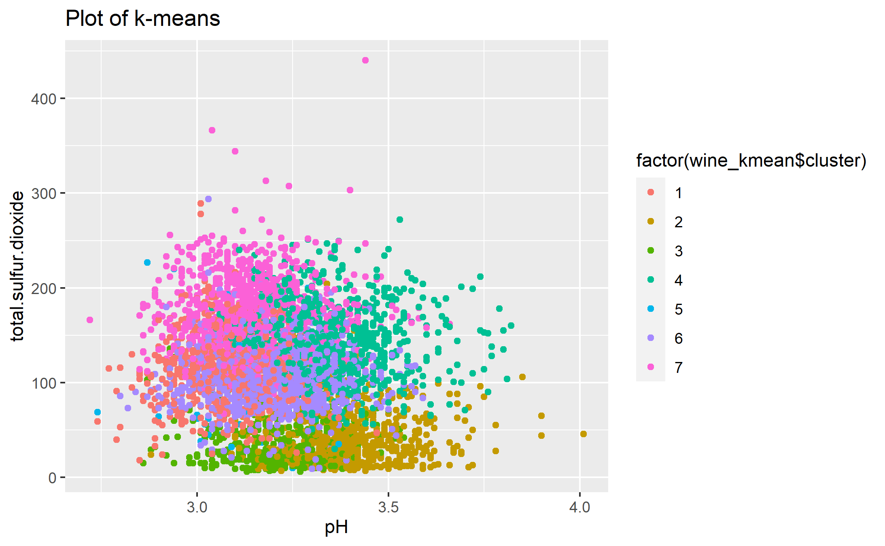
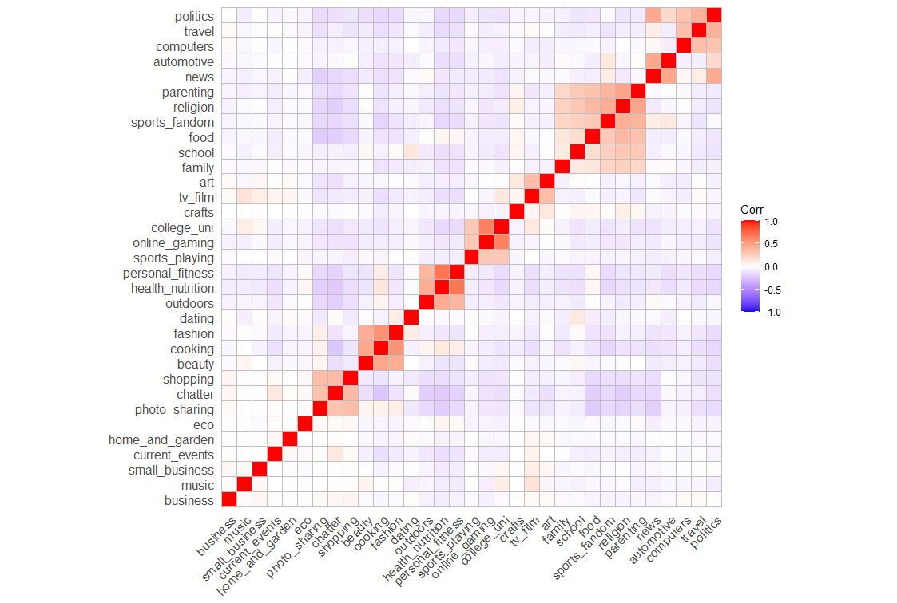

# 1) Clustering and PCA

## 1-1 Procedures

1.  Distinguishing White and Red

we used the method of PCA(rank=2) and the Clustering(K-means(K=2),
Hierarchical clustering with “single”, “complete” and “average”)

1.  Distinguishing Quality

we used the method of PCA(rank=2) and the Clustering(K-means(K=7)). Note
that the reason of not using hierarchical clustering is that this way
does not show

## 1-2 Result (White and Red)

### PCA

First, we shows the result of the PCA method, which looks like it can be
good identification.

### K-means

Second, we shows the result of the K-means method (K=2). This is the
graph of the actual data.

And, this is the k-means graph that looks like being able to be the same
as the actual data. So, we can think this method can distinguish data
into two parts(x-axis=pH, y-axis=fixed.acidity) because these factors
are different between white and red wines.

### Hierarchical clustering

Third, we used Hierarchical clustering with the minimum linkage of
“single”, “complete” and “average”. However, all of them looks like bad
identification. Probably because Hierarchical clustering identify data
into two parts step by step and so in the case of white and red
wine(they looks like almost same characteristics) this method doesn’t
work well with only unsupervised technique.

## 1-3 Result (Quality)

### PCA

We cannot distinguish the quality of the wine in PCA.

### Clustering

At the actual data, We cannot distinguish the quality of the wine well.

Therefore, we cannot judge that this clustering did work well.

## 1-4 Conclusion (Answers)

In conclusion, the best technique that makes sense to me was **“PCA”**
in our analysis because it can identify data into two parts
automatically. The second one is “K-mean” because if we set adequate
x-axis and y-axis, we can identify data well.

However, we cannot distinguish the quality of the wine well as we showed
above, probably because we need more the number of data on wine or these
characteristics on wine in data does not relate to the quality.

# 2) Market segmentation

## 2-1 Overview

1.  Make a model to identify spam and remove this data.

2.  (Now tryingh some methods)

## 2-2 Data and Model (how to do)

### 2-2-1 Data

-   Data: social\_marketing.csv

### 2-2-2 Data cleaning: Spam Removing

1.  in actual data, we crate a dummy variable tha is spam or not.
2.  with logit model(dependent variable: spam dummy, independent
    variable: all other variables), estimates the probability of spam by
    each individuals.
3.  if the probability of spam is over 0.5(50%), the person are judge as
    a spam.
4.  Remove actual spam, adult and estimated spam from raw dataset. So
    the number of observation in new dataset will decrease from 7882 to
    7309.

### 2-2-3 Model

-   Group Correlation

-   PCA

-   K-means Clustering

-   Hierachical Clustering

-   now trying diverse methods but I will left only some methods that
    can give us good results.

### 2-3 Result

#### Group Correlation

From this graph, we can get as follow: - eight groups are there 1.
college univ, online gamein, sports playing 2. fashion, cooking, beauty
3. personal fitness, health nutrition, outdoors 4. art, tv film 5.
crafts, automotive, news 6. politics, travel, computers 7. parenting,
religion, sports fandom, food, school, family 8. shopping, chatter,
photo sharing

-   the correlation happens near categories

#### PCA

#### K-means Clustering

#### Hierachical Clustering

### 2-4 Conclusion

### 2-5 Appendix
