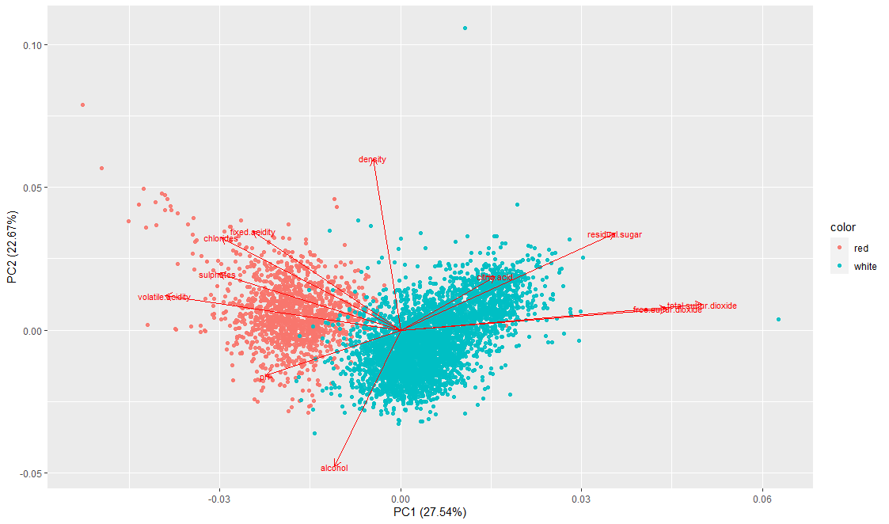
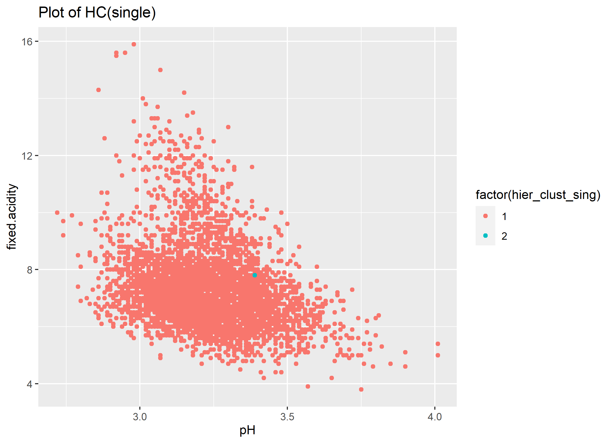
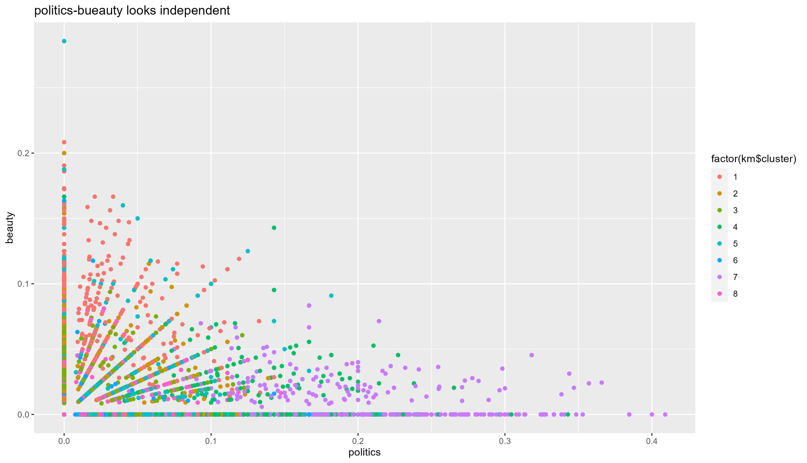
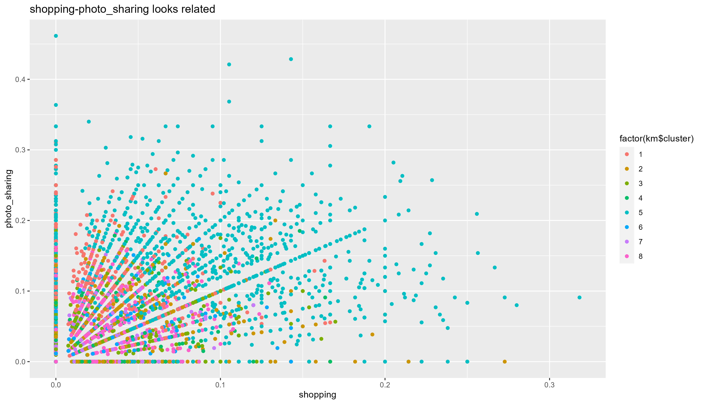
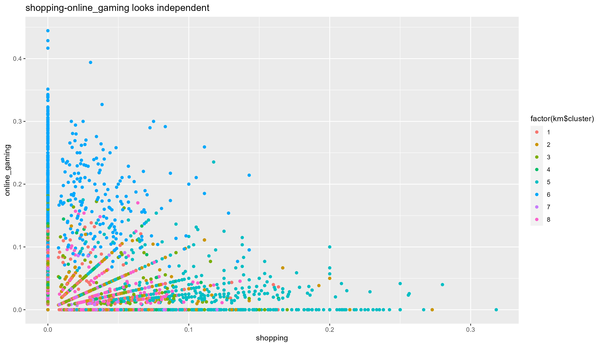
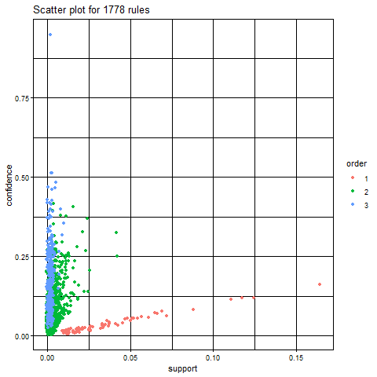
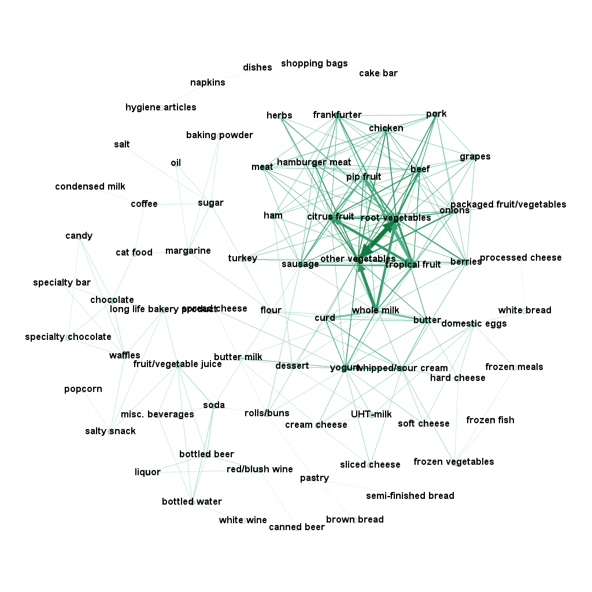

# 1) Clustering and PCA

## 1-1 Procedures

1.  Distinguishing White and Red

we used the method of PCA(rank=2) and the Clustering(K-means(K=2),
Hierarchical clustering with “single”, “complete” and “average”)

1.  Distinguishing Quality

we used the method of PCA(rank=2) and the Clustering(K-means(K=7)). Note
that the reason of not using hierarchical clustering is that this way
does not show

## 1-2 Result (White and Red)

### PCA

First, we shows the result of the PCA method, which looks like it can be
good identification.

Also, at another approach,

    [Result]
    Importance of first k=6 (out of 11) components:
                              PC1    PC2    PC3     PC4     PC5     PC6
    Standard deviation     1.7407 1.5792 1.2475 0.98517 0.84845 0.77930
    Proportion of Variance 0.2754 0.2267 0.1415 0.08823 0.06544 0.05521
    Cumulative Proportion  0.2754 0.5021 0.6436 0.73187 0.79732 0.85253

**From the results, we can notice that PC2 explains 50% of the
variations, and PC6 explains 85% as cumulative.**

Let’s first work on PCA1 and PCA2.

PCA1 and PCA2 were able to distinguish between red wines and white
wines. There are some blue points lay in the red circle, that’s because
their chemical properties must be very close to each others. However, in
general the algorithm succeed in differentiating the colors. In terms of
quality, it seems the higher quality wines are the points below 0 for
PCA2 and above 0 for PCA1 in general. However, let’s understand how PCA1
and 2 are formed.

From the graph above we can know that quality is negatively correlated
with density, fixed acidity, chlorides. On the other hand, it is
positively correlated with alcohol.

### K-means

Second, we shows the result of the K-means method (K=2). This is the
graph of the actual data.

And, this is the k-means graph that looks like being able to be the same
as the actual data. So, we can think this method can distinguish data
into two parts(x-axis=pH, y-axis=fixed.acidity) because these factors
are different between white and red wines.

### Hierarchical clustering

Third, we used Hierarchical clustering with the minimum linkage of
“single”, “complete” and “average”. However, all of them looks like bad
identification. Probably because Hierarchical clustering identify data
into two parts step by step and so in the case of white and red
wine(they looks like almost same characteristics) this method doesn’t
work well with only unsupervised technique.

## 1-3 Result (Quality)

### PCA

We cannot distinguish the quality of the wine in PCA.

### Clustering

At the actual data, We cannot distinguish the quality of the wine well.

Therefore, we cannot judge that this clustering did work well.

## 1-4 Conclusion (Answers)

In conclusion, the best technique that makes sense to me was **“PCA”**
in our analysis because it can identify data into two parts
automatically. The second one is “K-mean” because if we set adequate
x-axis and y-axis, we can identify data well.

However, we cannot distinguish the quality of the wine well as we showed
above, probably because we need more the number of data on wine or these
characteristics on wine in data does not relate to the quality.

# 2) Market segmentation

## 2-1 Overview

To understand market segments, we got two

1.  Eight groups from categorized items in the data

2.  Estimated which groups we should put “uncategorized” tweets into

Also, from these results, we suggested two points for “NutrientH20” in
the conclusion.

## 2-2 Data and cleaning

At first, We used social\_marketing.csv as a data, and did data cleaning
as follow:

1.  in actual data, we crate a dummy variable that is spam or not.
2.  with logit model(dependent variable: spam dummy, independent
    variable: all other variables), estimates the probability of spam by
    each individuals.
3.  if the probability of spam is over 0.5(50%), the person are judge as
    a spam.
4.  Remove actual spam, adult and estimated spam from raw dataset. So
    the number of observation in new dataset will decrease from 7882 to
    7309.

## 2-3 Model and Results

### How can we make more some groups to understnad market segements?

The data we got had so many categorised, and so it was hard to
understand the market and the trend of consumers’ preference. So we
tried to make more small groups from these data.

#### Correlation

First, we saw correlation between categorised items, and we got the
result in the following.

#### PCA and Correlation

Second, we thought there were eight groups from the above result, and
also did PCA with rank 8 and saw the correlation between PCs and
categoriesed item as follow:

##### Eight groups

From these above graphs, we can identify eight groups on market segments
as follow:

1.  (PC1) business small business, current events  
2.  (PC2) crafts, home and garden dating, school  
3.  (PC3) personal fitness, health nutrition, outdoors, travel,
    politics, computers  
4.  (PC4) art, tv film  
5.  (PC5) fashion, cooking, beauty  
6.  (PC6) college univ, online gaming, sports playing 
7.  (PC7) parenting, religion, sports fandom, food, family  
8.  (PC8) shopping, chatter, photo sharing  

We also did robustness check with K-means method in Appendix 2-5-1.

### Which kind of groups is close to “Uncategorized” tweet?

Also, we have identified which kind of groups “uncategorized” tweets are
close to. So we used the linear probability model(see detail in
Appendix). The coefficients that I got from the estimation is as follow:

<table>
<thead>
<tr class="header">
<th style="text-align: left;"></th>
<th style="text-align: left;">x</th>
</tr>
</thead>
<tbody>
<tr class="odd">
<td style="text-align: left;">PC1</td>
<td style="text-align: left;">-0.00154***</td>
</tr>
<tr class="even">
<td style="text-align: left;">PC2</td>
<td style="text-align: left;">0.00086***</td>
</tr>
<tr class="odd">
<td style="text-align: left;">PC3</td>
<td style="text-align: left;">-0.00056*</td>
</tr>
<tr class="even">
<td style="text-align: left;">PC4</td>
<td style="text-align: left;">-0.00050*</td>
</tr>
<tr class="odd">
<td style="text-align: left;">PC5</td>
<td style="text-align: left;">-0.00032</td>
</tr>
<tr class="even">
<td style="text-align: left;">PC6</td>
<td style="text-align: left;">-0.00278***</td>
</tr>
<tr class="odd">
<td style="text-align: left;">PC7</td>
<td style="text-align: left;">0.00064*</td>
</tr>
<tr class="even">
<td style="text-align: left;">PC8</td>
<td style="text-align: left;">0.00078*</td>
</tr>
<tr class="odd">
<td style="text-align: left;">Intercept</td>
<td style="text-align: left;">0.02301***</td>
</tr>
</tbody>
</table>

From the result, PC2, PC7 and PC8 are the almost same positive
coefficients. Combined Combined with Correlation and PCA’s heatmap, we
can think **the uncategorized tweet might be related to “art”, “tv
film”, and “business”**

## 2-4 Conclusion

### Summarized our results

To understand market segmentation easier, we suggested eight groups from
diverse categorized items. That is (1) business small business, current
events, (2) crafts, home and garden dating, school, (3) personal
fitness, health nutrition, outdoors, travel, politics, computers, (4)
art, tv film, (5) fashion, cooking, beauty, (6) college univ, online
gaming, sports playing, (7) parenting, religion, sports fandom, food,
family, and (8) shopping, chatter, photo sharing.

Also, we combined the result of these groups and the linear probability
model and estimated which kind of groups were close to “uncategorized”.
From the result, we could think “uncategorized” tweets might be related
to “art”, “tv film”, and “business”.

### Suggestion for “NutrientH20”

For “NutrientH20”, we suggested some points from these result. The first
one is “NutrientH20” should set one targets from eight groups to sell
drinks. As we showed, eight groups are related to one each other. Also,
it is not realistic to target all categorized consumer but they can do
to one of eight groups. So please refer to eight groups that we
identified when making a strategy on market targeting.

Second, if “NutrientH20” find “uncategorized” tweets, they should think
that they are in (2), (7) and (8) out of eight groups. This is helpful
if they make a plan of market research in real, such as save their time
to being confusing which kind of groups they should put uncategorized
tweets into.

## 2-5 Appendix

### 2-5-1: Robustness check (K-means Clustering)

Also, to do robustness check, we did K-means clusterinig.

At the first top left picture, we can see tweets on beauty and politics
does not relate to each others. But at the second top right picture, we
can see tweets on travel and politics had positive relationship. Also,
at the third bottom left picture, tweets on shopping and photo sharing
had some positive relationship as well. However, at the fourth bottom
right picture, it seems us that tweets on shopping and online gaming
does not relate to each others.

These results are consistent with eight groups that we identified from
the method of the correlation and PCA.

### 2-5-2: Linear probability model

The linear probability model we used in this analysis is as follow:
*u**n**c**a**t**e**g**o**r**i**z**e**d* *t**w**e**e**t**s* = *β*0 + *β*\[*P**C*1−*P**C*8\] + *ε*
The reason that we used the linear probability model is that that does
not lose the information on the number of uncategorized tweets.(if the
logit model, we have to create new dummy, uncategorized tweet or not.
But in this case, we will lose the information on the number of
uncategorized tweets.)

Also the detailed of the result is as follow:

    lm(formula = uncategorized ~ PC1 + PC2 + PC3 + PC4 + PC5 + PC6 + 
        PC7 + PC8, data = Z)

    Residuals:
         Min       1Q   Median       3Q      Max 
    -0.04850 -0.02167 -0.00760  0.01287  0.35468 

    Coefficients:
                  Estimate Std. Error t value Pr(>|t|)    
    (Intercept)  0.0230056  0.0003588  64.112  < 2e-16 ***
    PC1         -0.0015385  0.0002111  -7.288 3.49e-13 ***
    PC2          0.0008640  0.0002211   3.907 9.42e-05 ***
    PC3         -0.0005596  0.0002319  -2.413   0.0158 *  
    PC4         -0.0004999  0.0002451  -2.039   0.0414 *  
    PC5         -0.0003249  0.0002535  -1.282   0.2000    
    PC6         -0.0027772  0.0002842  -9.774  < 2e-16 ***
    PC7          0.0006390  0.0002976   2.147   0.0318 *  
    PC8          0.0007779  0.0003287   2.366   0.0180 *  
    ---
    Signif. codes:  0 ‘***’ 0.001 ‘**’ 0.01 ‘*’ 0.05 ‘.’ 0.1 ‘ ’ 1

    Residual standard error: 0.03068 on 7300 degrees of freedom
    Multiple R-squared:  0.02481,   Adjusted R-squared:  0.02374 
    F-statistic: 23.22 on 8 and 7300 DF,  p-value: < 2.2e-16

# Association rules for grocery purchases

## 3-1 Overview, Data and Model

-   <Data:%5Bgroceries.txt>\](groceries.txt)  
-   At first, we did Data cleaning for aplying for apriori function in
    the package of the “arules”. That includes each people’s id and data
    of something they bought.  
-   Next, we crated grphml data from the apriori function with support =
    0.005, condience=0.1, maxlen = 4, and lift &gt;2. Regarding
    selecting these parameters, we are careful of what some data had bot
    high confidence and high supports because they are considered a
    strong rule. 
-   Finally, we used Gephi to make a grpah from graphml data

## 3-2 Results and Conlcusion

The former plot is the support-confidence plot. The latter plot is the
graphml plot.

For the former plot, as we mentioned before, we can see that some data
has high supports and high confidence.

For the latter plot, we can find somethings as follow:

-   Overall, the connection between vegetables, meats and fruits are
    strong. This means all of these products are bought by consumers
    daily.

-   root vegetables and other vegetables are strong connection. So few
    consumer will buy root vegetables.  

-   consumers who bought whole milk bought dairy products like yougrt,
    curd and butter. Probably because these products are located in near
    place and so consumers tends to buy other dairy products on that
    way.  

-   frankfurter and tropical fruit’s connection is a little bit of
    strong probably because consumers want them to do BBQ.
